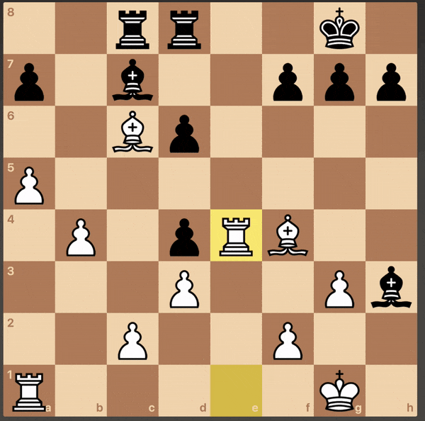
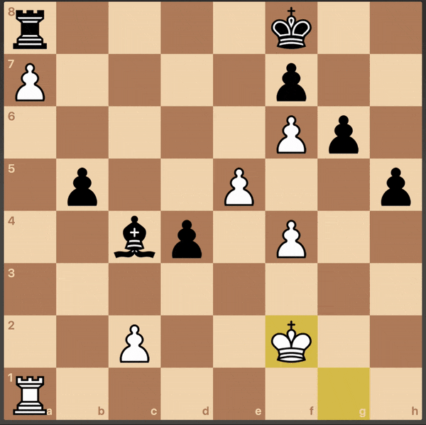

Blundered my way into a very nice endgame today. I was playing with the white pieces.

While exchanging pieces to get into an endgame with equal material, I blundered away my bishop by playing pawn captures on f4 instead of bishop captures on h3. 

When they pushed pawn to D3, I realised I can trap them if rook captures on A7 because the black king was put in a tough spot by the white pawn on f6, and the black pawn on f7 didnt give it any space to move the second rank either. I played c3, and they played d2 as expected. I played a wait move with king to e3. They queened the pawn, with the idea that the black rook can capture the advanced pawn on the open A-file. After the capture, it was just a mate in one, when I moved the rook to d8.

This pushed my win streak to 8, my highest so far.

